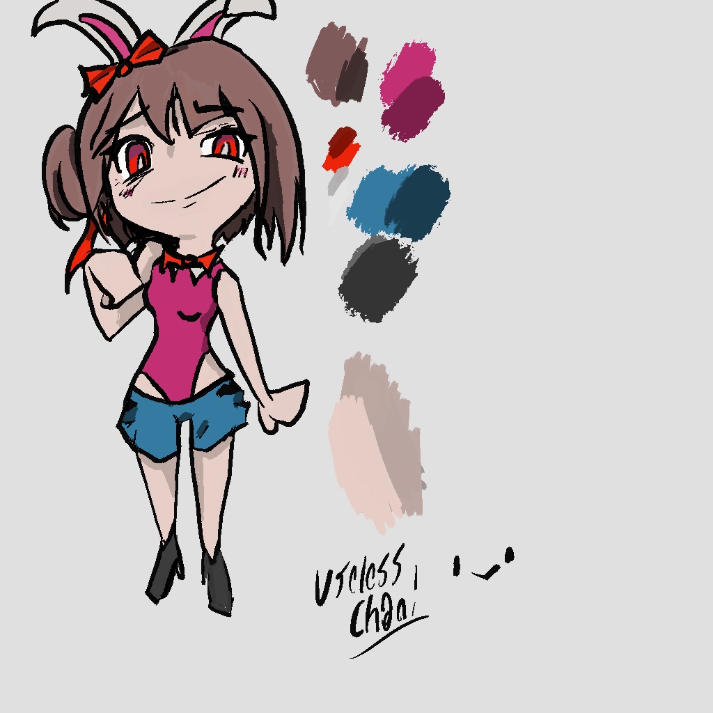
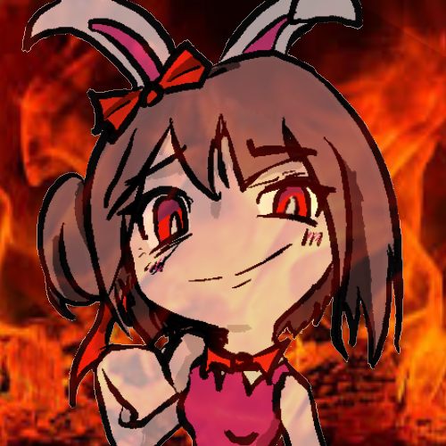
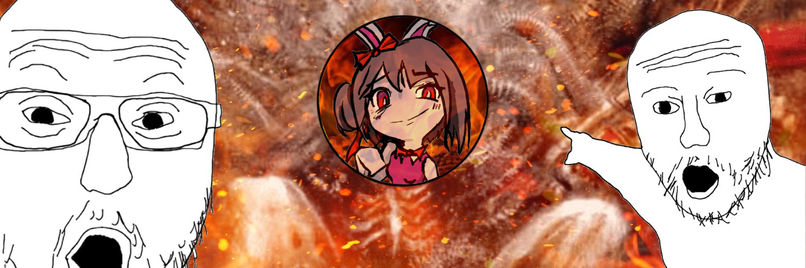

# 26-03-08

Now, we need to create some assets.

First, I need a logo for the page and design a mascot and the rebuild the banners for the socials.

For the original banner is `1500x500px`, the logo can be a just a circular thumbnail.

I need to design the character tho; Im thinking of a bunny-girl with a sassy attitude and red color scheme. I kinda like the one im using as a placeholder.

For the background on the site im thinking in something tiling.
Like a flower drawing that I can just repeat over and over, I can make it in procreate in a jiffy.

I can make it about random little skulls or something like that.
Or maybe imperial paraphernalia. It COULD be a good excuse to study skull anatomy tho.

Something that Ill also need to make now that we are at it, is to create templates for designing clothes and hairstyles.
You know, something that I can **actually** use for design works.

However I feel like making tools right now.

We have our mascot! Useless chan!

I need to change some of the colors of the site to match her motif.
